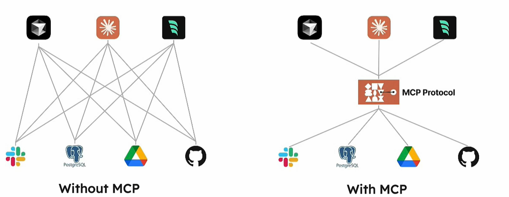

### MCP（模型上下文协议） 定义

MCP是一个开放协议，标准化了应用程序向大型语言模型提供上下文的方式。

**MCP提供：**

- 更多的预建集成可供给大型语言模型

- 为AI应用程序构建自定义继承的标准化方法

- 所有人都可以使用开放协议

- 在不同程序之间切换并随身携带上下文的灵活性

    

**核心特点：**

- 协议标准化：统一工具调用格式

- 生态兼容性：一次开发即可对接所有兼容MCP的模型

- 动态扩展：新增工具无需修改模型代码，即插即用

