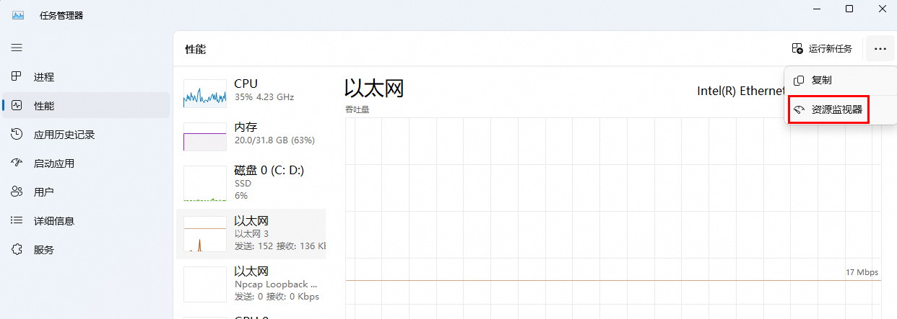
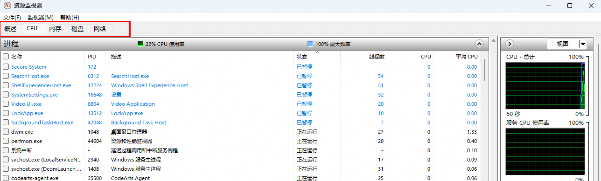

## 任务管理器

### 1、进程

1. 强制关闭卡死或顽固的软件

### 1、主页（进程）

- 实时查看当前正在运行的应用程序和后台进程。
- 可以查看它们的 CPU、内存、磁盘和网络占用率。
- 如果某个软件卡死，可在此选中它并点击顶部的结束任务。

### 2、性能
 
- 直观查看电脑的 CPU、内存、GPU、网络以及硬盘的实时运行图表和详细参数（如主频、运行速度等）。

- 资源监视器
    

    

### 3、应用历史记录
 
显示各个应用在过去一段时间内消耗的资源总量。

### 4、启动应用

管理开机自动启动的软件，可以通过禁用不需要的程序来加快电脑开机速度。

### 5、用户
   
查看当前登录系统的账户及各账户运行的进程。

### 6、详细信息

传统的系统进程详细列表，支持设置进程优先级、关联 CPU 等高级操作。

### 7、服务

查看和管理 Windows 系统的各项后台服务（如启动或停止特定服务）